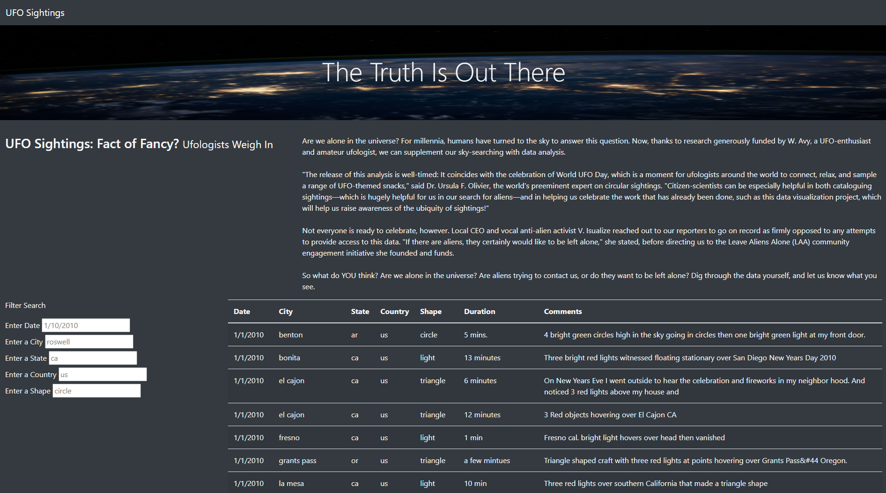
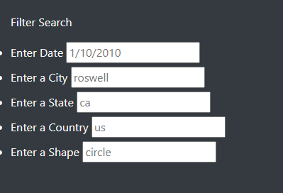
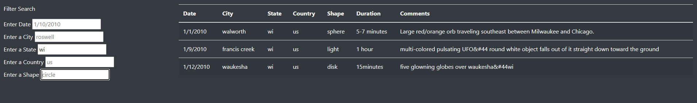
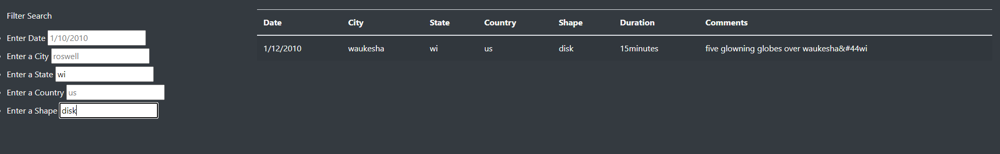

# UFOs
Module 11 Challenge: UFO sightings

## Overview of the UFO Sightings Project
The purpose of the UFO sightings project was to create a comprehensive analysis of UFO sightings that allows users to filter UFO sighting data by various criteria at the same time. Filter critria include date of sighting, city, state, country and shape.

## Results
The UFO Finder webpage providers an easy-to-use interface for users to filter UFO sighting data by filter criteria including: 
- date
- city
- state
- country
- shape

The webpage also includes high level information related to UFO sightings, including infomration related to World UFO Day, opportunities to catalogue sightings, and the Leave Aliens Alone initiative founded by V. Isualize. 

Upon accessing the webpage, users will see the following view:

The filters section includes the criteria listed above and also has placeholder text to show the format of input needed:

The user can filter by multiple criteria at one time. Here is an example of one filter applied: 

Here is an example of two filter criteria utilized at one time, which helps the user focus the search to specified criteria (in this case, state: "wi" and shape: "disk"):

## Summary 
While this webpage is a great resource for filtering UFO sightings by multiple criteria at once, it's important to recognize that one drawback of the webpage is that the filter function looks for an exact match and will not find entries that are similar or like the input criteria. This requires significant attention to format of input criteria. One recommendation to further enhance this webpage would be to include duration as a filter criteria. Another recommendation is to allow filtering on the comments field based on "like" text.
